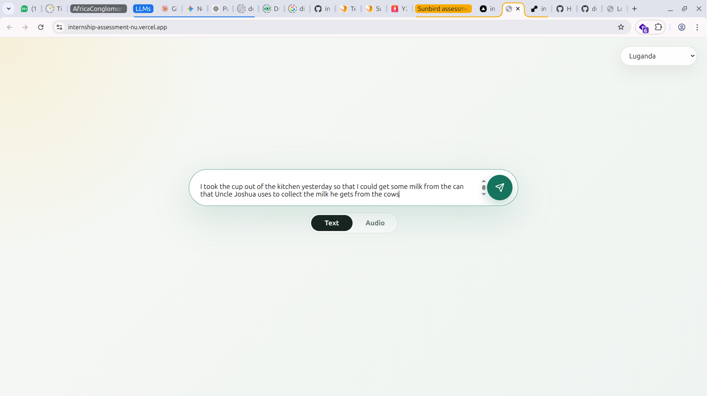
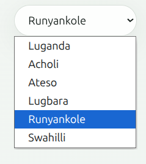
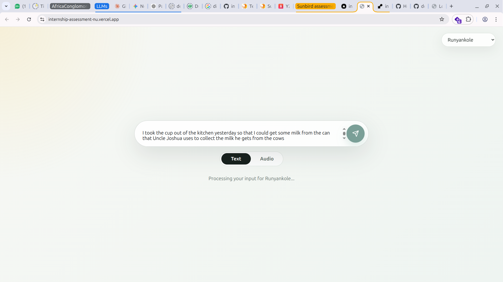
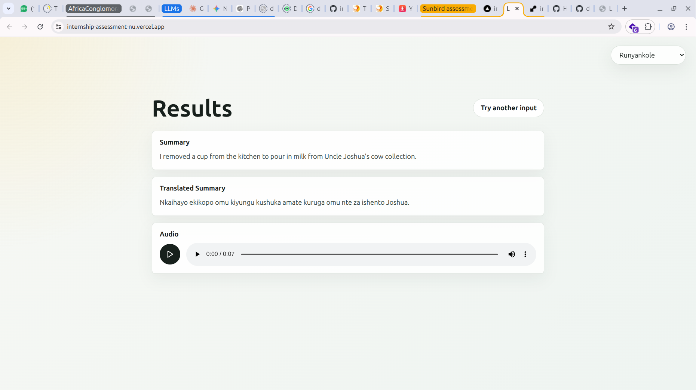
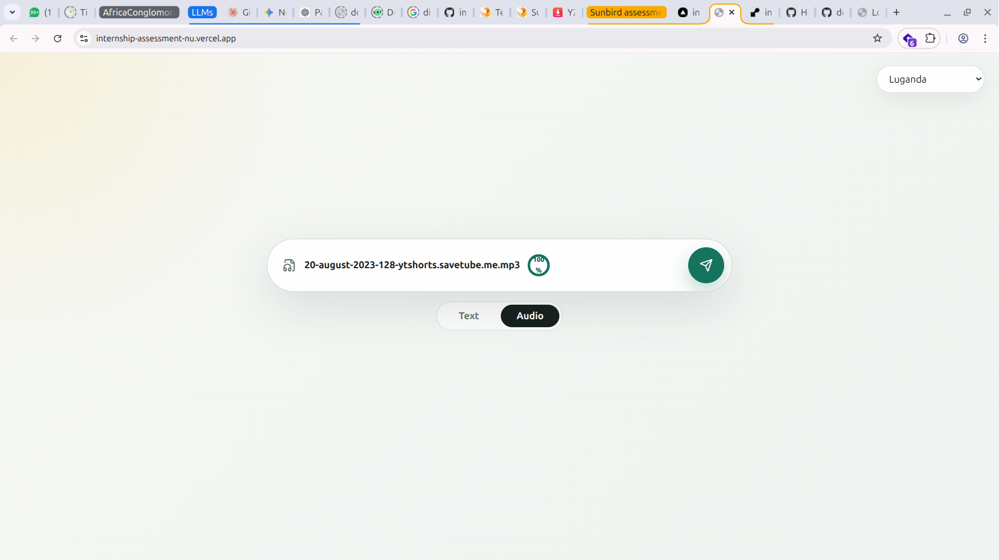
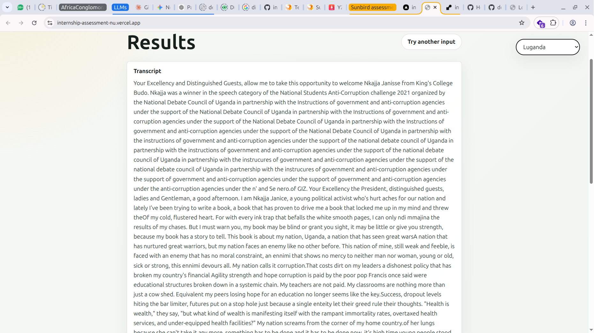
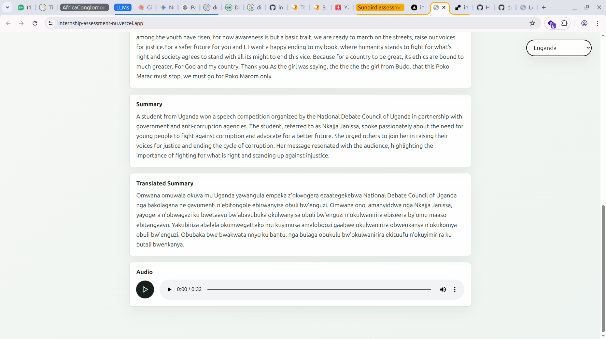

# GenAI Webapp - SunbirdAI Internship Assessment

This project was built as part of an internship assessment for SunbirdAI. It is a small GenAI web application that accepts either text or an audio upload, summarises the content, translates the summary into a selected local language, and generates playable audio for the translated summary using Sunbird AI APIs.

The assessment also required deploying a live application. This project has been deployed and can be tested here:

Live application: https://internship-assessment-nu.vercel.app/

## Project Structure

```text
.
├── GenAI_Webapp/
│   ├── backend/        # FastAPI service and Sunbird API wrapper
│   └── frontend/       # Next.js app
├── venv/               # Python virtual environment used by the backend
├── exercises/          # Original assessment programming exercises
└── requirements.txt    # Original assessment exercise requirements
```

Be careful with the two Python requirement files:

- Root `requirements.txt` is for the original programming exercises.
- `GenAI_Webapp/backend/requirements.txt` is for the FastAPI backend.

## Architecture

```text
User input
  ├── Text input
  └── Audio upload
        ↓
FastAPI backend
        ↓
Sunbird STT, for audio only
        ↓
Sunbird summarisation
        ↓
Sunbird Sunflower translation
        ↓
Sunbird TTS
        ↓
Next.js results UI
```

The UI displays every available intermediate result: transcript for audio input, summary, translated summary, and generated audio. If a later pipeline step fails, completed earlier results are still shown with a meaningful error message for the failed step.

## Local Setup

Clone the repository and enter the repository root:

```bash
git clone <your-repository-url>
cd internship-assessment
```

### Backend

The backend uses the virtual environment at the repository root: `internship-assessment/venv`.

From the repository root:

```bash
python3 -m venv venv
source venv/bin/activate
pip install -r GenAI_Webapp/backend/requirements.txt
```

Create the backend environment file:

```bash
cp GenAI_Webapp/backend/.env.example GenAI_Webapp/backend/.env
```

Edit `GenAI_Webapp/backend/.env` and set:

```env
SUNBIRD_API_KEY=your_sunbird_api_key_here
SUNBIRD_BASE_URL=https://api.sunbird.ai
FRONTEND_ORIGIN=http://localhost:3000
PUBLIC_BACKEND_URL=http://localhost:8000
```

Then start the backend from the backend directory:

```bash
cd GenAI_Webapp/backend
../../venv/bin/uvicorn main:app --reload --port 8000
```

The backend health check should be available at:

```text
http://localhost:8000/health
```

### Frontend

Open a second terminal. If you are in the parent directory that contains `internship-assessment`, enter the frontend with:

```bash
cd internship-assessment/GenAI_Webapp/frontend
```

If you are already in the repository root, use:

```bash
cd GenAI_Webapp/frontend
```

Install dependencies:

```bash
npm install
```

Create the frontend environment file:

```bash
cp .env.example .env
```

Make sure `.env` points to the local FastAPI backend:

```env
NEXT_PUBLIC_BACKEND_URL=http://localhost:8000
```

Start the frontend:

```bash
npm run dev
```

Open:

```text
http://localhost:3000
```

## Environment Variables

Backend variables live in `GenAI_Webapp/backend/.env`:

- `SUNBIRD_API_KEY`: Sunbird API key used by the FastAPI backend.
- `SUNBIRD_BASE_URL`: Sunbird API base URL. Defaults to `https://api.sunbird.ai`.
- `FRONTEND_ORIGIN`: frontend origin allowed by FastAPI CORS. Use `http://localhost:3000` locally.
- `PUBLIC_BACKEND_URL`: public URL used when returning generated audio links. Use `http://localhost:8000` locally.
- `SUNBIRD_STT_LANGUAGE`: optional STT language/adapter. Defaults to `lug`.
- `SUNBIRD_TTS_TEMPERATURE`: optional TTS generation setting.
- `SUNBIRD_TTS_MAX_NEW_AUDIO_TOKENS`: optional TTS generation setting.

Frontend variables live in `GenAI_Webapp/frontend/.env.local`:

- `NEXT_PUBLIC_BACKEND_URL`: FastAPI backend URL used by the browser.

## Usage

### Text Input

1. Enter or paste the text you want to process into the central text box.

   

2. Select the target language from the dropdown, then click the circular send button.

   

3. Wait while the app summarises the text, translates the summary, and generates the audio.

   

4. Review the generated summary, translated summary, and audio player.

   

### Audio Input

1. Switch to audio input, then click the composer to select an audio file or drop the file directly into the composer.

   

2. Choose the target language from the dropdown.

   

3. Click the circular send button to submit the audio file.

   

4. Wait while the app transcribes the audio, summarises the transcript, translates the summary, and generates the audio output.

   

5. Review the transcript, summary, translated summary, and generated audio player.

   

Audio files longer than 5 minutes are rejected with a clear error message.

## Known Limitations

- The app depends on a valid Sunbird API key.
- Audio uploads are capped at 5 minutes.
- Supported target languages are Luganda, Acholi, Ateso, Lugbara, and Runyankole.
- Generated TTS audio is saved by the backend and served from `/audio`.
- If one Sunbird operation fails, later steps cannot run, but completed earlier results are still displayed.
